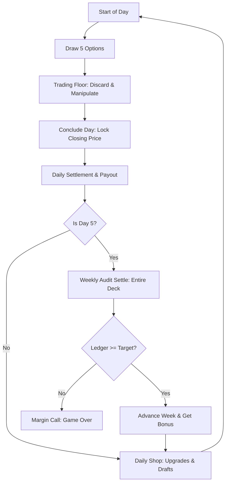

# Game Design Document & Walkthrough: "Margin Call"

This document serves as the Technical Game Design Document (GDD) and verification report for the refined pre-production prototype of **Margin Call**.

---

## 1. Game Design Terminology

To establish a common language for future development, we use the following terminology:
* **The Portfolio (Deck):** The entire collection of options contracts currently owned by the player.
* **Active Hand:** The 5 option contracts drawn at the start of each trading day from the Portfolio.
* **Underlying Asset Price:** The market price of the single underlying stock traded on the terminal (starts at $100.00).
* **Volatility Index ($V$):** A percentage rating (0.0 to 1.0) tracking market uncertainty. Higher volatility increases the random price swings (shocks) of the Asset Price.
* **Speculative Load (Options Outstanding):** The total weight of your Portfolio against market float capacity. Adding options increases this weight; removing them reduces it.
* **Margin Ledger:** The firm's capital buffer. Receives 90% of all option exercise yields.
* **Broker Cash:** The player's personal wallet (used to purchase upgrades, draft options, and cover transaction fees in the daily shop).

---

## 2. The Core Gameplay Loop

The game operates on a repeating **5-Day Cycle (One Week)** followed by a weekend audit review.

---

## 3. Mathematical Specifications

### Daily Settlement Math
At the end of Days 1–5, the hand of 5 cards is evaluated against the locked Closing Price:
1. **Call Option Payout (Additive):**
   $$\text{Call Yield} = \max(0, \text{Closing Price} - \text{Strike Price}) \times \text{Leverage}$$
2. **Put Option Payout (Additive):**
   $$\text{Put Yield} = \max(0, \text{Strike Price} - \text{Closing Price}) \times \text{Multiplier} \times \text{Leverage}$$
3. **Daily Hand Payout Yield:**
   $$\text{Daily Yield} = \sum \text{Call Yields} + \sum \text{Put Yields}$$
4. **Broker Earnings (Progressive Tax):**
   * Daily Salary: $50.00 base (increased to $100.00 with the *Leveraged Capital* upgrade).
   * Daily Commission:
     * 10% on the first $100 of Daily Yield.
     * 5% on the next $400 of Daily Yield.
     * 2% on any Yield above $500.
     * *(Broker Rebate upgrade adds a flat +5% to the commission rates).*
5. **Firm Margin Ledger:**
   $$\text{Ledger Addition} = \text{Daily Yield} \times 90\%$$

### Weekly Audit Math (The Boss Fight)
At the end of Day 5, the entire Portfolio (your entire deck) is exercised at once against the final day's closing price:
$$\text{Weekly Yield} = \sum \text{All Deck Call Yields} + \sum \text{All Deck Put Yields}$$
If $\text{Margin Ledger} \ge \text{Week Target}$, you survive and advance. Otherwise, you trigger a Margin Call (Permadeath/Run End).

---

## 4. Interactive Mechanics

### Discarding & Price Manipulation
* Dragging a card into the **Open Market Discard Desk** (or clicking **Discard Contract**) discards it, draws a replacement from the draw pile, and shifts the Asset Price:
  * **Call Option Discards:** Shift price **up** (sentiment boost).
  * **Put Option Discards:** Shift price **down** (sentiment dump).
* Discards build **Volatility** (+1% to +8% per card, depending on risk tier).

### The Option Liquidator (Card Removal)
* Accessible in the Daily Shop.
* Allows you to permanently remove options from your Portfolio for a flat transaction fee of **$20.00 cash** to prevent OTM puts from clogging your deck or diluting your draws.

### The Short Squeeze Victory Condition
* Every option in your deck contributes to Portfolio Speculative Load:
  * Low Tier Cards = **4 Options**
  * Medium Tier Cards = **8 Options**
  * High Tier Cards = **15 Options**
* If the total weight of your deck exceeds your **Float Capacity** (starts at 100), it triggers a Short Squeeze and you win the game instantly!

---

## 5. Phase 7: Option Upgrades & Yield Sums Updates
* **Put Multiplier Calculations:** Updated Put payout formulas to correctly multiply by `card.multiplier || 1` in all states, ensuring the code matches card text.
* **Calls & Puts Separation:** The sidebar inside the trading desk now breaks down Call Option Yield and Put Option Yield separately before displaying the Potential Day Yield.
* **Daily & Weekly Settle Recap:** The daily settle screen shows the exact dollar yields of all held options. The weekly settle screen pre-calculates and projects the entire deck's exercise yields to give players complete audit visibility.
* **Leverage Transition Path:** Shop drafts now show the precise transition path of leverage upgrading (e.g. `x1 → x10 LEV`).

---

## 6. GME Speculator Features & Compact Rebranding

We have successfully transitioned the game into **GME Speculator** and added several features:
* **GME Theme:** The traded asset is GME (GameStop Corp). The terminal logs, UI elements, and ranks utilize Reddit/WallStreetBets culture (e.g. "Diamond Hands", "DFV Tracker", "Managing Director of Arbitrage").
* **Starter Risk Decks:** Players choose between:
  1. *Low Risk (Conservative):* More Calls, fewer Puts, tight spreads.
  2. *Medium Risk (Balanced Ape):* Balanced starter deck.
  3. *High Risk (Degen Speculator):* Heavy Puts, Moonshot Calls, high volatility spreads.
  * *Strike prices and price shifts are randomized slightly ($\pm \$2$ strike / $\pm \$1$ price shift) at deck creation to make every playthrough unique.*
* **Overnight Volatility Shifts:** At the end of each day, GME stock undergoes overnight shifts based on volatility. Upgrades like *Overnight Insurance* (caps negative shift at -5%) and *Volatility Hedge* (halves volatility shock) protect GME price.
* **Intraday Gamma Squeezes:** When GME price surges above $200.00 during the day, a Gamma Squeeze is triggered! A special dashed line is plotted on the chart. Call option payouts in hand are doubled at that day's settlement.
* **Weekend option exercising & Rollover Fees:** On Day 5, players manually exercise or roll over contracts for a $15 rollover fee. Refills are automatically added if the deck drops below 5 cards.
* **The Short Squeeze Boss Fight:** When portfolio weight exceeds 65% of Float Capacity, players can initiate a Short Squeeze to drain the Hedge Fund's $10,000 liquidity pool. Achieving a GME price past $500 or bankrupted fund leads to instant Short Squeeze Victory.
* **Corporate Ranks & retirement:** Ranks advance weekly. Players can retire to the Bahamas from Week 2 onwards if cash $\ge \$1,500$.
* **Compact & Readable Layout:** We reduced panel padding (to 10px), compactified card sizes (to 145x220px), and minimized the chart size (to 180px) to fit everything optimally. We enabled vertical scrolling behavior on the body to guarantee that no assets are clipped or hidden on smaller viewports, maximizing ease of use and readability.
* **GME Special Operations Control Panel:** Header-linked debug modal toggles shifts, gamma squeezes, manual desk, skips crashes, forces gamma squeezes, edits price/cash/volatility/hedge fund liquidity, changes ranks/archetypes, injects 100x leverage calls/puts, cheats weekly targets, and forces Squeeze War.

---

## 7. Interactive Strategy & Tutorial Guide
We compiled a comprehensive gameplay and tutorial guide located in the artifact [tutorial.md](file:///C:/Users/nicko/.gemini/antigravity/brain/aafc1015-dd13-47de-9fd9-5574a6795b35/tutorial.md). This includes:
* Captured walkthrough screenshots of all screens (Title, Intro, Floor, Debug, Settle, Squeeze War).
* The **Discard Synergy Principle** (how to balance and dump contracts to shift GME prices).
* Volatility stabilization and deck pruning rules.
* Core Week 1 progression methods and shop prioritizations.

---

## 8. Week Replenishment & OTC Inventory System
We have introduced a robust deck maintenance cycle and a dedicated tactile consumable inventory:
* **Weekly Portfolio Replenishment:** At the transition between weeks (when survivors move to the `WEEKLY_SHOP`), the options deck keeps all selected rolled-over contracts and is automatically replenished with **5 brand-new randomized options contracts** matching the player's risk profile (Low, Medium, or High). Strike prices and price shifts are randomized for the new options to keep the gameplay loop sustainable and varied.
* **Persistent OTC Inventory:** OTC consumable upgrades (Reddit Pump, Short Raid, Dark Pool, Synthetic Put Protection) have been moved out of the option contracts deck. When purchased from the Shop, they are now stored in `state.otcInventory`.
* **OTC Tactical Desk UI:** An interactive panel has been added to the trading desk sidebar. It displays current quantities owned of each consumable.
* **Intraday Tactical Deployments:** Players can click **[ACTIVATE]** next to any owned OTC consumable directly from the trading desk sidebar during regular trading hours. Activating a contract applies its effect instantly (e.g. +/-15% GME price adjustment or active modifiers like Dark Pool zero-shift discard or Synthetic Put daily yield floor) and increments volatility by +1.5%.

---

## 9. Live Server Instructions

The local development server is active and running:
* **Terminal Preview Address:** [http://localhost:5173/](http://localhost:5173/)

We have verified that the project compiles cleanly under strict TypeScript guidelines and packaging succeeds with 0 errors. You can run test transactions, draft calls, liquidate puts, and observe the real-time SVG charting updates directly in the browser!
